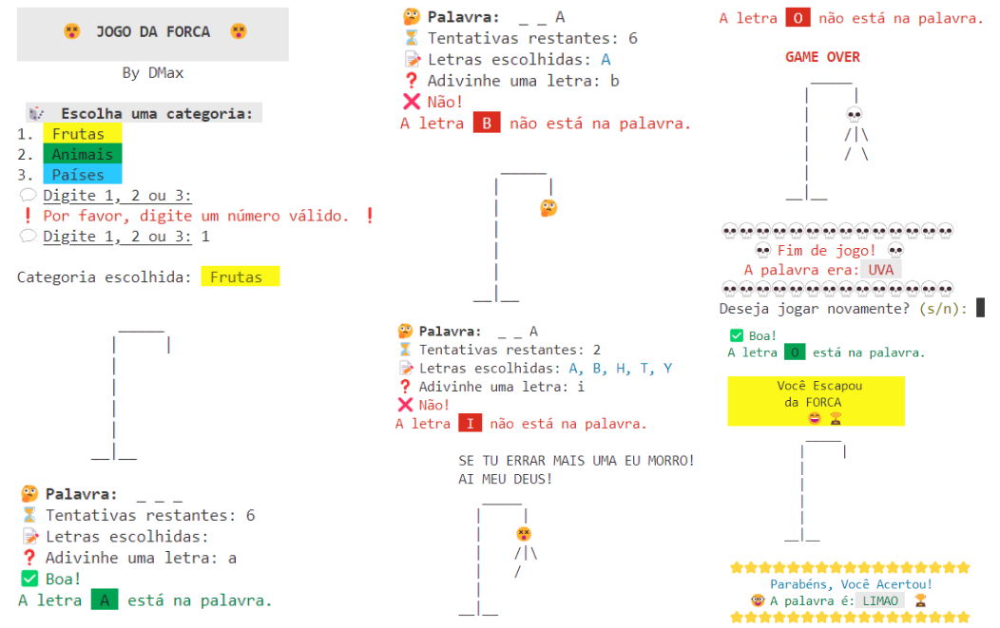

## 👋🏽 Hey, DMax aqui! 
### Está foi minha versão Final do projeto `Desafio do Jogo da Forca`, onde pude executar o que aprendi no programa Capacita Brasil, nas aulas de Lógica de Programação até aqui, e além disso, pesquisando e descobrindo mais ferramentas como:
- <ins>Controle de Cores no Terminal:</ins> *O uso de ** **códigos ANSI** ** (\033[47m, \033[31m, etc.) para alterar a cor do texto e do fundo no terminal, melhorando a experiência visual e a interface de usuário.*
- <ins>Emoticons e Ícones Unicode:</ins> *Inclusão de emojis e outros ícones gráficos no terminal usando ** **caracteres Unicode** ** (como \U0001F635, \U0001F914), o que contribui para uma interface mais divertida e amigável.*
- <ins>Randomização:</ins> *O uso da ** **função random.choice()** ** para selecionar aleatoriamente uma palavra a partir de uma categoria fornecida.*

# 🎯 Projeto Final Capacita Brasil - Desafio do Jogo da Forca  
Este projeto foi desenvolvido como parte do curso **Programa Residência em TIC 20 Capacita Brasil / C-Jovem**. O objetivo é criar uma versão digital do clássico **Jogo da Forca**, onde o jogador tenta adivinhar uma palavra oculta letra por letra.  

---

## 🛠️ Tecnologias Utilizadas  
- **Linguagem:** Python
- **Controle de Versão:** Git e GitHub  

---

## 🚀 Funcionalidades  
✅ Menu Interativo<br>
✅ Seleção de categorias de palavras<br>
✅ Contagem de tentativas e registro de letras erradas<br>
✅ Representação visual do progresso do jogo (Acertos, Erros, Derrota e vitória)<br>
✅ Opção de replay do jogo para jogar novamente<br>
✅ Estruturas de repetição e condicionais para a lógica do jogo<br> 

---


## 📌 Sobre o Jogo 

### 🔹 Pré-requisitos  
  - Ter Python instalado 
    - Clonar este repositório:  
      ```bash
      git clone https://github.com/Davidmax90/Capacita-Brasil-Projeto-Final.ByDMax.git
      cd Capacita-Brasil-Projeto-Final.ByDMax 


## 👥 Equipe
- David Marques 
- Ericka Mayarea
- Kaio Vinicius
- Bianca Leão 
- Ariel Rodrigues 
- Diego da Silva
<br>


> [!WARNING]
> ### 📜 Licença
> Este projeto está sob a licença MIT - veja o arquivo LICENSE para mais detalhes.
